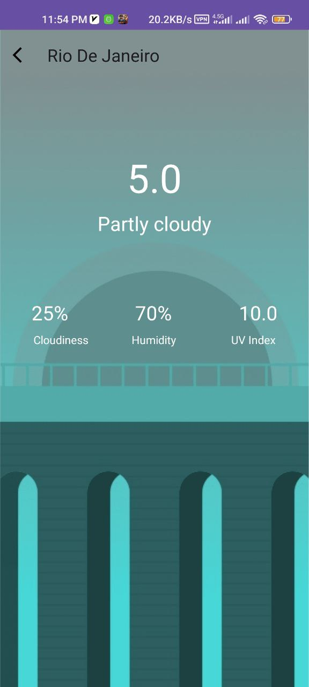

# WeatherCityInfo App

WeatherCityInfo is an Android application written in Kotlin that provides real-time temperature and water conditions for various cities. With an intuitive user interface, users can easily access weather information, including temperature, humidity, and the likelihood of precipitation. The app also enhances the user experience by visually representing precipitation with corresponding images.

# Key Features

City-wise Weather: Get up-to-date weather information for different cities.

Temperature Details: View current temperature and humidity levels for each city.

Visual Representation: Understand the probability of precipitation through visually appealing images.

User-Friendly Interface: Intuitive design for seamless navigation and a pleasant user experience.

# How to Use

Launch the app and select the desired city.

Instantly access temperature and humidity details.

Get a quick overview of precipitation likelihood with intuitive visuals.

Screenshots:

# Installation

Clone the repository: git clone https://github.com/vakiliali79/Weather-City-Info-Android.git

Open the project in Android Studio.

Build and run the application on your Android device or emulator.

Feel free to contribute, report issues, or suggest improvements. Your feedback is valuable!

## Screenshots:

- **Screenshot 1**:

  

- **Screenshot 2**:

  

- **Screenshot 3**:

  

